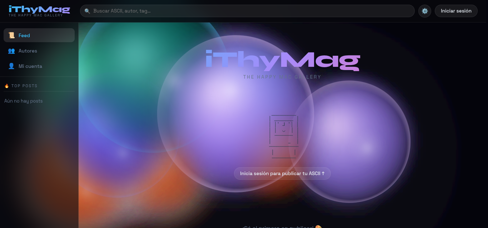

# **🎨 iThyMag

**iThyMag** es una galería interactiva de ASCII Art diseñada para entusiastas de la estética retro-digital. La aplicación permite a los usuarios explorar, compartir, editar y organizar sus creaciones favoritas en un entorno visualmente impactante con efectos de plasma dinámicos.

🌐 **Sitio Web Real:** [https://ithymag.web.app/](https://ithymag.web.app/)

💻 **Repositorio GitHub:** [https://github.com/Qmaker-programmer/IThyMag](https://github.com/Qmaker-programmer/IThyMag)

## **✨ Características Principales**

* **Galería de ASCII Art:** Explora una amplia colección de arte basado en caracteres.  
* **Fondo de Plasma Dinámico:** Un fondo interactivo en Canvas con "blobs" que reaccionan a la configuración y profundidad (simulación 3D).  
* **Gestión de Contenido:** Sistema completo de login, subida de arte, edición y eliminación (integrado con Firebase).  
* **Panel de Detalles "Push":** Visualización lateral de piezas de arte con animaciones suaves y opciones de compartir/copiar.  
* **Configuración Personalizada:** Controla efectos visuales como el desenfoque, colisiones de blobs, modo compacto y reducción de movimiento.  
* **Persistencia:** Las preferencias se guardan localmente mediante cookies.

# Vista previa



## **🛠️ Stack Tecnológico**

* **Frontend:** React (Vite)  
* **Estilos:** CSS3 (Variables personalizadas y animaciones "spring")  
* **Backend & Auth:** Firebase (Firestore & Firebase Auth)  
* **Renderizado:** Canvas API (para el fondo de plasma)

## **🚀 Instalación y Desarrollo**

Sigue estos pasos para ejecutar el proyecto en tu máquina local:

### **1\. Clonar el repositorio**

```bash
git clone \[https://github.com/Qmaker-programmer/IThyMag.git\](https://github.com/Qmaker-programmer/IThyMag.git)  
cd ithymag
```

### **2\. Instalar dependencias**

```bash
npm install
```

### **3\. Configurar Firebase 🔑**

Para que la base de datos y la autenticación funcionen, debes configurar tus propias credenciales:

1. Crea un proyecto en [Firebase Console](https://console.firebase.google.com/).  
2. Habilita **Authentication** (Google y Email/Password) y **Cloud Firestore**.  
3. Crea un archivo llamado src/firebaseConfig.js con el siguiente formato:

```js
import { initializeApp } from "firebase/app";  
import { getFirestore } from "firebase/firestore";  
import { getAuth, GoogleAuthProvider } from "firebase/auth";

const firebaseConfig \= {  
  apiKey: "TU\_API\_KEY",  
  authDomain: "TU\_PROYECTO.firebaseapp.com",  
  projectId: "TU\_PROYECTO",  
  storageBucket: "TU\_PROYECTO.appspot.com",  
  messagingSenderId: "TU\_ID",  
  appId: "TU\_APP\_ID"  
};

const app \= initializeApp(firebaseConfig);  
export const db \= getFirestore(app);  
export const auth \= getAuth(app);  
export const googleProvider \= new GoogleAuthProvider();
```

### **4\. Ejecutar en modo desarrollo**

```bash
npm run dev
```

## **🎨 Personalización**

Puedes ajustar la experiencia visual desde el menú de **Ajustes**:

* **Fancy Background:** Activa/desactiva los blobs de plasma.  
* **Desenfoque:** Cambia la intensidad del efecto *glassmorphism*.  
* **Modo ASCII Mono:** Fuerza a que el arte se vea en blanco puro para un look más clásico.

## **📂 Estructura del Proyecto**

* App.jsx: Componente principal, lógica de Firebase y layout.  
* PlasmaBackground.jsx: Motor de renderizado Canvas para el fondo.  
* Settings.jsx: Gestión de configuración y persistencia de cookies.  
* App.css e index.css: Estética, temas y animaciones.

## **🧹 Mantenimiento del Repositorio (.gitignore)**

El proyecto ignora automáticamente archivos innecesarios o sensibles:

* node\_modules/ \- Dependencias instaladas.  
* dist/ \- Archivos de producción generados por Vite.  
* .env y secretos \- Credenciales privadas.  
* Logs y archivos de configuración de editores (VSCode, JetBrains).
---
# Creado por **Qmaker/Quack (Andres)**.
